# homeii-music-flow

<p align="center">
  
</p>

<p align="center">
  <a href="https://github.com/r11a/homeii-music-flow"></a>
  
  
  
  
</p>

`homeii-music-flow` is a premium Home Assistant dashboard card for Music Assistant.
It was created to make music control feel like a real listening experience, not just a row of playback buttons.

The card is built around a simple idea: the music area in a smart home should feel alive, elegant, useful, and personal.
It should look beautiful on a wall tablet, feel natural on a phone, and still give fast access to serious controls like queue, players, announcements, favorites, sleep timer, and library search.

## The Story

I do not come from a programming background.

This project started from a product and UX vision: I wanted my Home Assistant music dashboard to feel like a real premium interface, with the polish of a dedicated music product and the practicality of a smart-home control panel.

The implementation was built through many iterations with Codex.
I brought the direction, the feeling, the usage patterns, the Hebrew/RTL needs, and the daily dashboard problems.
Codex helped turn that vision into a working, structured, testable Home Assistant card.

That is part of what makes this project meaningful to me: it is not just code.
It is a proof that a clear product vision, careful UI/UX taste, and an AI coding partner can become a real usable tool.

## Screenshots

### Main Experience

<p align="center">
  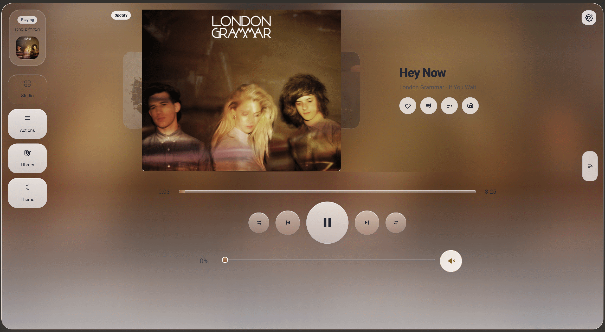
</p>

### Studio / Players / Queue

| Studio view | Player grouping | Queue |
| --- | --- | --- |
| 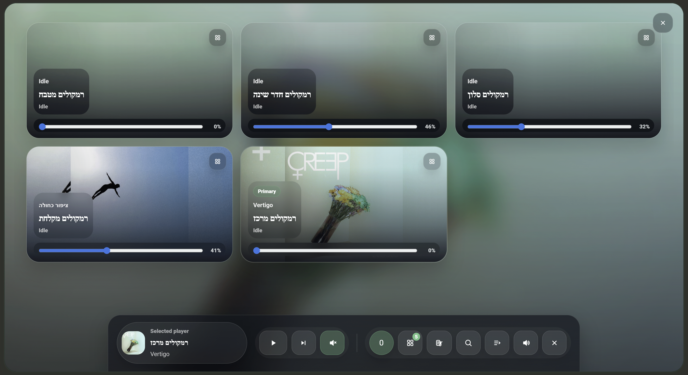 | 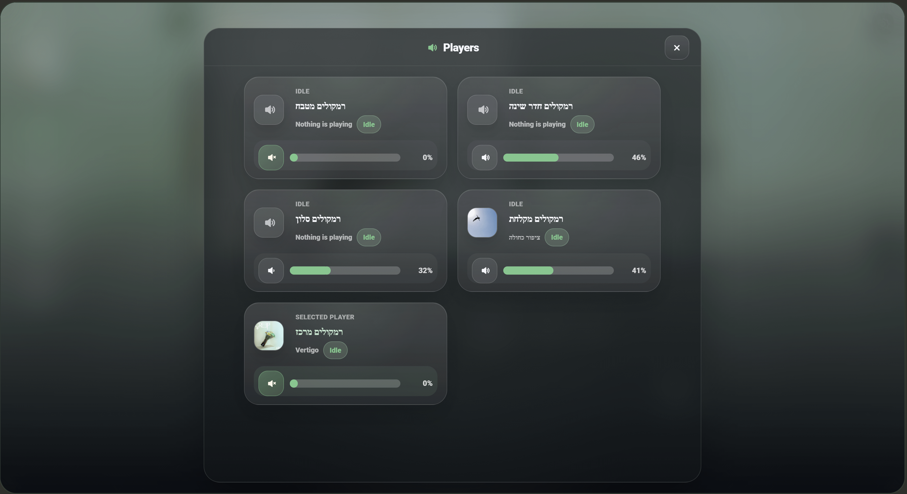 | 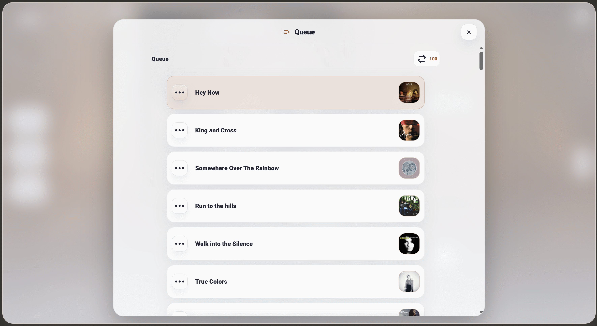 |

### Library / Actions / Settings

| Library | Actions | Settings |
| --- | --- | --- |
| 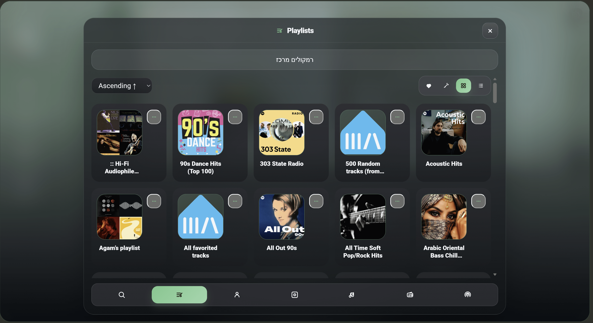 | 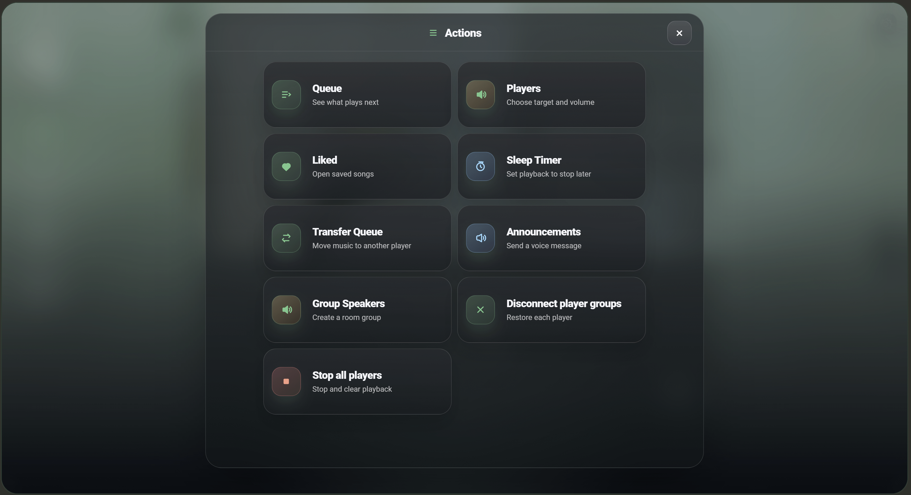 | 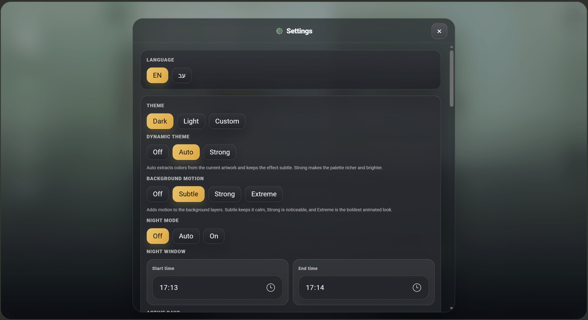 |

### Lyrics / Announcements / Tablet

| Lyrics | Announcements | Tablet layout |
| --- | --- | --- |
| 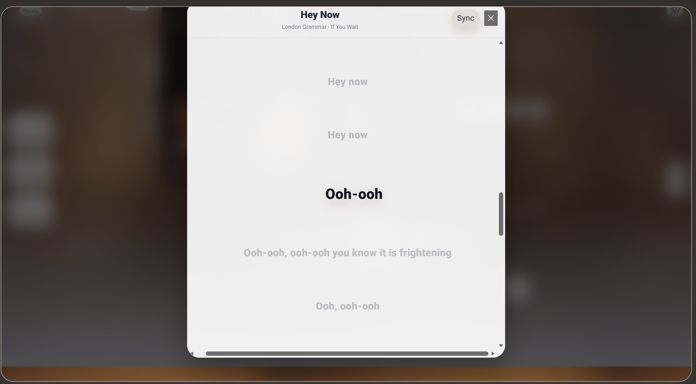 | 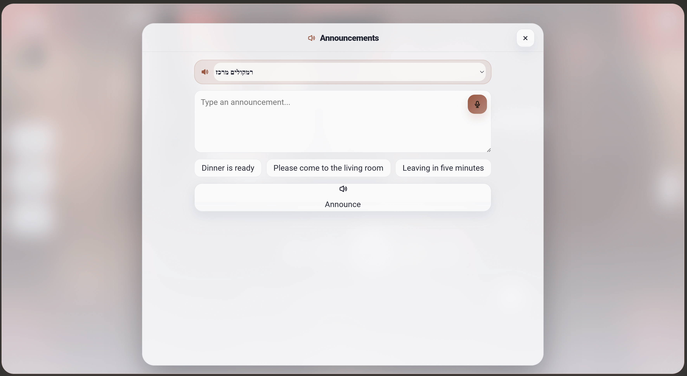 | 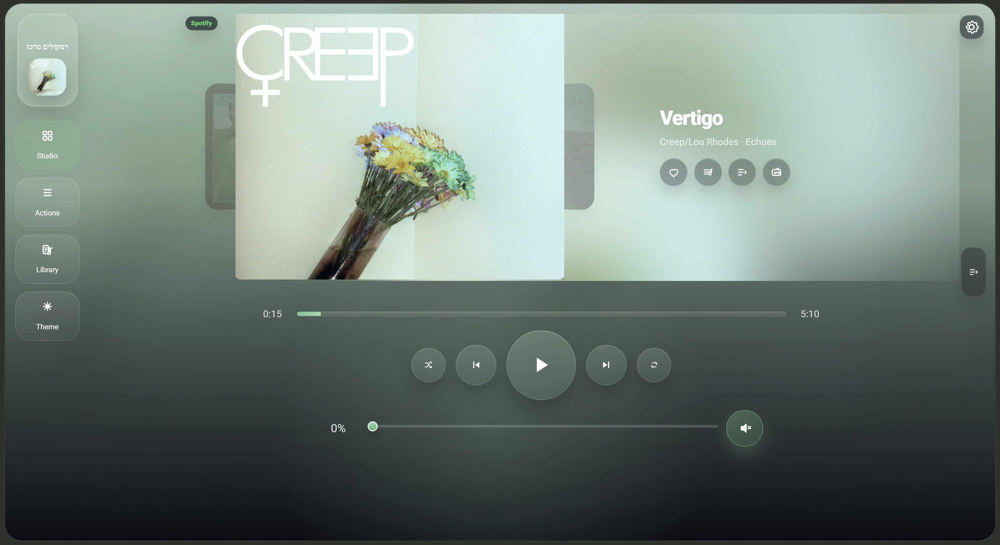 |

### Mobile Details

| Mobile 1 | Mobile 2 | Mobile 3 |
| --- | --- | --- |
| 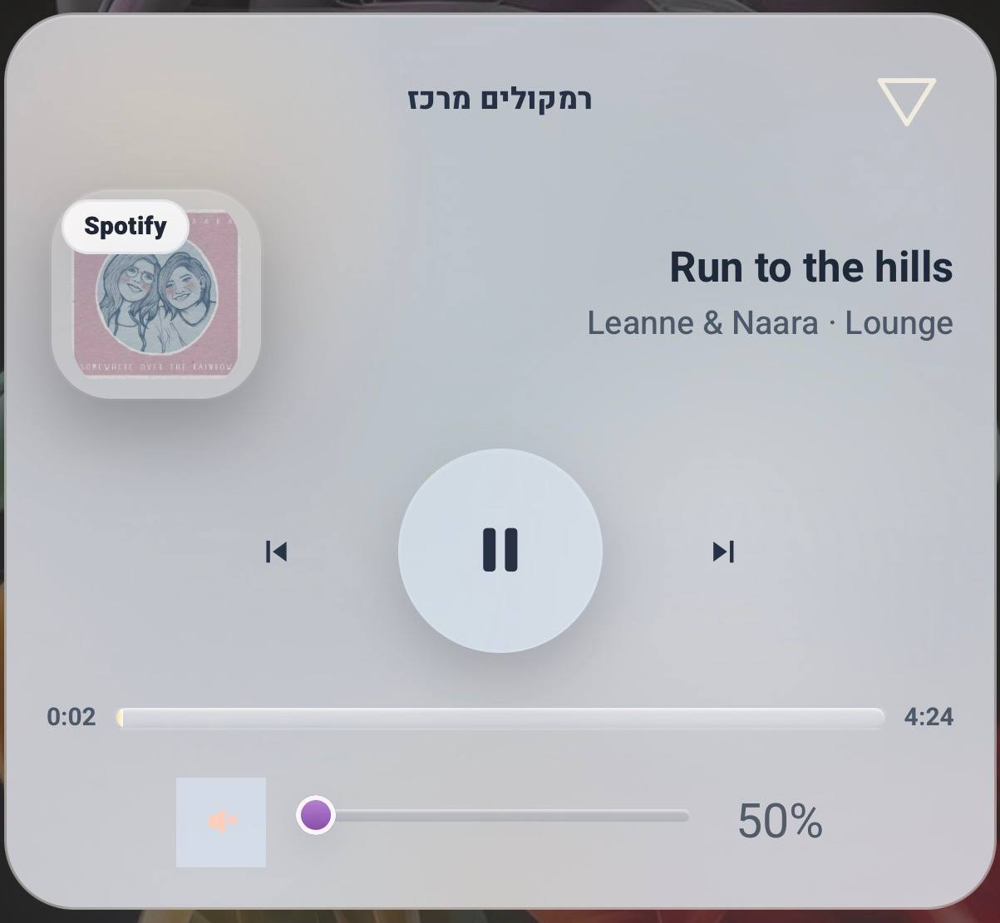 | 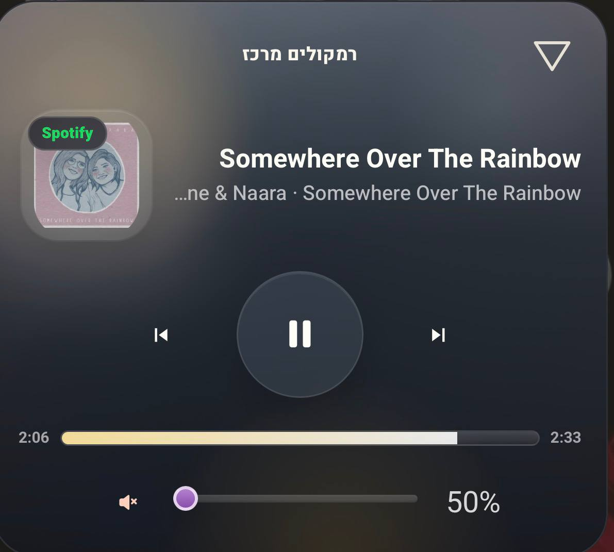 | 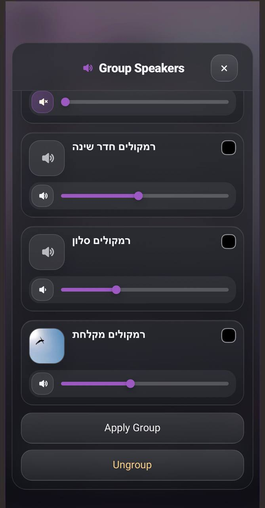 |

| Mobile 4 | Mobile 5 | Mobile 6 |
| --- | --- | --- |
| 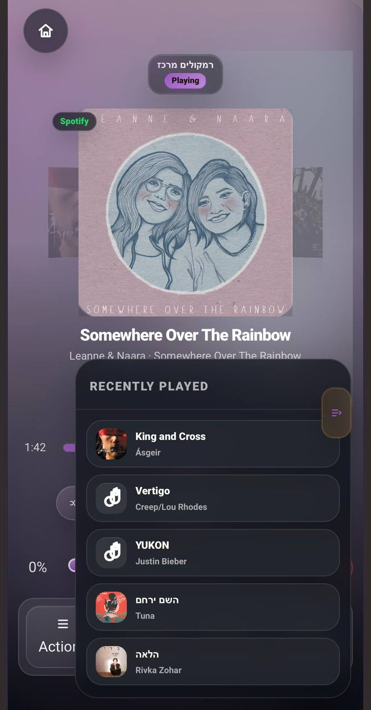 | 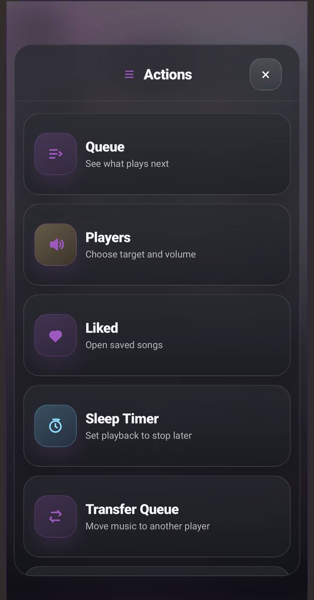 | 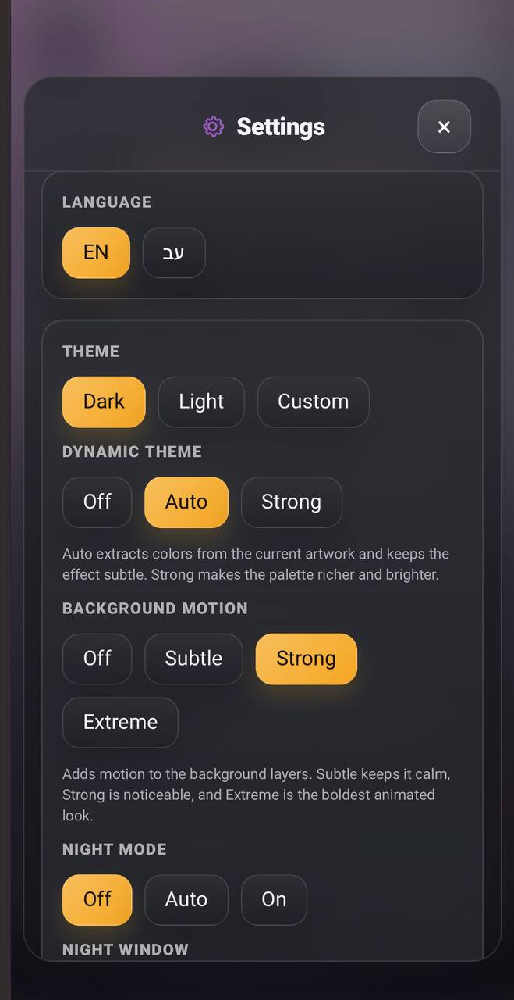 |

| History | Mobile 7 |
| --- | --- |
| 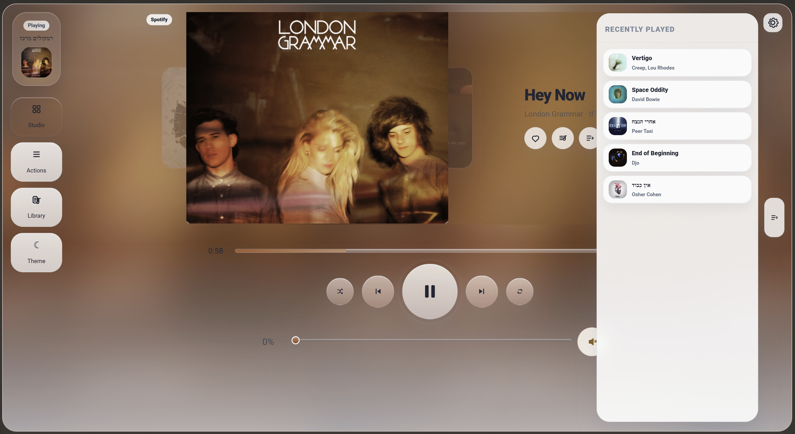 | 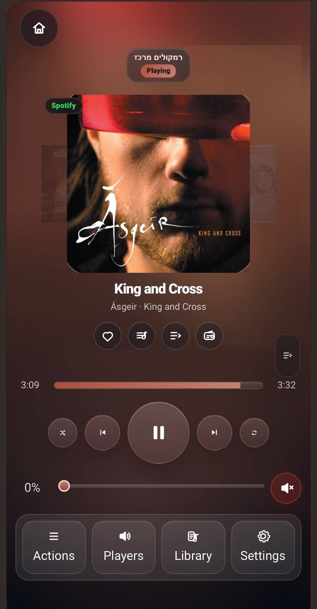 |

## What Makes It Different

Most Home Assistant media cards are control surfaces.
This card is designed as a listening surface.

It combines:

- immersive artwork-led now-playing UI
- dynamic visual atmosphere based on the current music
- real mobile-first ergonomics
- queue, search, players, actions, and settings in one flow
- Hebrew and English support with RTL-aware layout
- Music Assistant library browsing
- multi-player and room control
- announcements and sleep timer controls
- a visual settings system for day-to-day tuning
- a release structure that can keep improving without becoming chaos

## Complete Feature List

### Now Playing

- Large artwork-first now-playing presentation
- Blurred artwork background and ambient visual treatment
- Track title, artist, album, and source metadata
- Source/provider badge display
- Quality/provider metadata foundations
- Missing-artwork fallback state
- Idle, unavailable, loading, and playing states
- Long title and long artist handling
- Hebrew/RTL-safe metadata alignment
- Main now-playing layout for tablet and desktop
- Mobile now-playing layout for narrow screens
- Immersive full player view
- Compact mode for dashboard-dense layouts
- Up-next visibility support
- Recent playback/history foundations

### Playback Controls

- Play / pause
- Previous track
- Next track
- Shuffle toggle
- Repeat toggle
- Repeat-one icon/state support
- Progress bar
- Seek interaction
- Live progress refresh
- Transport controls in regular and immersive layouts
- Touch-friendly control sizing
- Visual active states for playback controls

### Volume

- Volume slider
- Mute / unmute
- Soft mute handling
- Last volume memory by player
- Large player volume controls
- Control-room volume handling foundations
- Volume presets
- Mobile volume mode: always visible or button-triggered
- Per-player volume display in player/group screens
- Slider fill styling and thumb styling for light/dark modes

### Queue

- Embedded queue panel
- Full queue view
- Compact queue cards
- Mini queue list
- Active queue item highlighting
- Previous/past queue item styling
- Up-next state resolution
- Queue search
- Queue and library combined search flow
- Clear search and back-to-queue behavior
- Queue item artwork
- Queue item duration
- Queue item context actions
- Play now
- Shuffle play
- Play next
- Add to queue
- Queue transfer between players
- Queue rebuild/reorder foundations
- Empty queue state
- Queue action success/failure feedback

### Library

- Music Assistant library access
- Library home view
- Playlists
- Artists
- Albums
- Tracks
- Radio
- Podcasts
- Favorite radio
- Recently played
- Recently added
- Discover/random album sections
- Library caching
- Grid collection rendering
- Track list rendering
- Track grid/list toggle
- Play all
- Shuffle all
- Add library item to queue
- Play library item now
- Search across library categories
- No-results state
- Library loading and error states

### Radio Browser

- Radio Browser country list support
- Country filter support
- Top-voted station discovery
- Station search
- Radio metadata normalization
- Radio identity detection
- Radio playback detection
- Radio artwork/favicon support where available

### Favorites and Likes

- Music Assistant favorite detection
- Local liked-state mode
- Optimistic favorite updates
- Favorite cache entries
- Current-media favorite matching
- Queue-based favorite state resolution
- Favorite remove-argument resolution
- Favorite radio support
- Liked library tab support

### Lyrics

- Lyrics screen
- Track lyrics loading
- Lyrics unavailable state
- No lyrics found state
- Lyrics payload normalization
- Lyrics cache
- Lyrics icon and navigation support

### Players and Multi-Room

- Player picker
- Selected player summary
- Active players view
- Browser player detection
- "This device" player flow
- Waiting-for-device-player state
- Other players section
- Pinned player support
- Multiple pinned player support
- Player grouping
- Group speakers modal
- Apply group
- Ungroup
- Group membership detection
- Static group handling foundations
- Derived group stats
- Stop all players
- Player transfer target selection
- Player state indicators for playing/paused/idle
- Player artwork/track preview in player cards

### Announcements

- Announcement screen
- Target player selection
- Announcement text input
- Up to three announcement presets
- Preset fill buttons
- TTS entity configuration
- Automatic TTS entity fallback detection
- Text-to-speech announcements
- Music Assistant announcement playback fallback
- Hebrew/English announcement language detection
- Voice dictation button when supported by the browser
- Announcement success/failure feedback

### Sleep Timer and Night Mode

- Sleep timer menu
- +15 / +30 / +60 minute actions
- Clear/cancel sleep timer
- Sleep timer countdown label
- Sleep timer footer/chip display
- Sleep timer persistence in local storage
- Night mode: off / auto / on
- Night mode start/end times
- Night mode day selection
- Overnight window handling
- Night-mode-triggered sleep timer state
- Sleep timer and night mode helper tests

### Actions

- Dedicated actions menu
- Sleep timer shortcut
- Announcements shortcut
- Queue/player action shortcuts
- Home shortcut option
- Studio shortcut option
- Customizable action visibility through settings foundations
- Fast mobile access to the most-used controls

### Search

- Global search input
- Search clear button
- Debounced search timers
- Search across radio, podcasts, albums, artists, tracks, and playlists
- Queue search
- Library search
- Side search summary
- No-results messaging
- Search UI adapted for mobile/tablet layouts

### Theme and Visual System

- Auto / light / dark theme modes
- Theme toggle button
- Custom color support
- Dynamic theme from current artwork
- Dynamic theme modes: off / auto / strong
- Dynamic palette cache
- Background motion modes: off / subtle / strong / extreme
- Light theme refinements
- Dark theme refinements
- Accent color resolution
- Color mixing and palette tuning helpers
- Background glow and artwork aura treatment
- High-contrast text handling
- Custom text tone: light/dark

### Mobile UX

- Mobile-first shell
- Mobile compact mode
- Expandable compact behavior
- Mobile up-next toggle
- Mobile footer modes: icon / text / both
- Optional footer search
- Mobile main bar customization
- Mobile library tab customization
- Mobile font scale
- Mobile swipe mode: change song or browse covers
- Mobile mic mode: on / off / smart
- Mobile volume mode: always / button
- Mobile home shortcut
- Mobile studio shortcut
- Mobile settings stored locally
- Mobile layout tuned for one-handed use

### Tablet and Desktop UX

- Tablet layout mode
- Auto layout mode
- Height-aware layout adaptation
- Desktop wide layout
- Responsive grid behavior
- Resize strategy foundations
- Tablet sheet sizing for library, search, queue, actions, players, group players, and settings
- No horizontal overflow in key layouts
- Stable panel spacing and control alignment

### Language and RTL

- English labels
- Hebrew labels
- Auto language mode
- Manual language toggle
- RTL layout support
- RTL-safe controls for sliders and playback controls
- Hebrew-friendly settings labels
- Hebrew announcement flow
- Editor locale helpers

### Settings and Editor

- Built-in Home Assistant visual editor support
- Config form support
- Config validation
- Language configuration
- Theme configuration
- Layout mode configuration
- Settings source mode: device / visual / UI / card
- Night mode configuration
- Favorite button configuration
- Queue command configuration
- Mobile custom color configuration
- Dynamic theme configuration
- Background motion configuration
- Font scale configuration
- Footer/search/studio/home shortcut configuration
- Volume/mic/liked/swipe mode configuration
- Library tab configuration
- Main bar item configuration
- Announcement preset configuration
- Announcement TTS entity configuration
- Compact mode and up-next configuration
- Pinned player configuration

### Reliability and Release Foundation

- Structured `src/core` foundation helpers
- Config validators
- State defaults and derived state helpers
- Mobile settings normalization
- Responsive layout helpers
- Palette and dynamic theme helpers
- Night mode and sleep timer helpers
- Media queue identity and matching helpers
- Favorites and optimistic favorite-state helpers
- Player, pinned-player, and grouping helpers
- Media presentation helpers for artwork, metadata, lyrics, and duration formatting
- History and source-badge helpers
- Vitest coverage for high-risk logic
- ESLint configuration
- Vite build flow
- Release sync script
- HACS validation workflow
- QA matrix for viewport/theme/interaction checks

## Installation

### HACS Custom Repository

1. Open HACS in Home Assistant.
2. Open `Custom repositories`.
3. Add this repository:

```text
https://github.com/r11a/homeii-music-flow
```

4. Choose repository type `Dashboard`.
5. Install the repository.
6. Add the card to a dashboard:

```yaml
type: custom:homeii-music-flow
```

If HACS does not add the resource automatically, add:

```text
/hacsfiles/homeii-music-flow/homeii-music-flow.js
```

### Manual Install

1. Copy `dist/homeii-music-flow.js` into your Home Assistant `www` folder.
2. Add this Lovelace resource:

```text
/local/homeii-music-flow.js?v=5.0.0
```

3. Use the card:

```yaml
type: custom:homeii-music-flow
```

## Basic Example

```yaml
type: custom:homeii-music-flow
language: auto
rtl: true
theme_mode: auto
show_theme_toggle: true
```

## Project Structure

```text
dist/homeii-music-flow.js   stable runtime for Home Assistant / HACS
src/homeii-music-flow.js    current main source snapshot
src/core/                   extracted foundations for state, queue, players, media, theme, layout
src/config/                 config validators
tests/                      regression coverage for core logic
scripts/release.mjs         release sync tooling
docs/media/                 screenshots and GIF previews for the repo page
docs/qa-matrix.md           viewport/theme/interaction release gate
```

## Development

```text
npm install
npm run build
npm run lint
npm test
```

Current packaged version: `5.0.0`

## Design Principles

- The interface should feel premium, but not noisy.
- The card should be beautiful before you touch it and useful after you touch it.
- Mobile is not a smaller desktop; it is a different rhythm.
- A smart-home music UI should make common actions fast without hiding advanced ones.
- Hebrew/RTL support should feel designed, not patched on.
- Configuration should be approachable without losing depth.
- The visual system should follow the music, the artwork, and the context.

## Status

`5.0.0` is the first stable public release of this repository.

The repository is prepared for:

- GitHub publishing
- HACS custom repository installation
- future HACS default-listing preparation
- continued UI/UX iteration
- deeper documentation and more live GIF demos

## Documentation

- [Local deployment guide](./LOCAL_DEPLOYMENT.md)
- [Publishing checklist](./PUBLISHING.md)
- [QA matrix](./docs/qa-matrix.md)
- [Repo assets checklist](./docs/repo-assets-checklist.md)
- [Changelog](./CHANGELOG.md)
