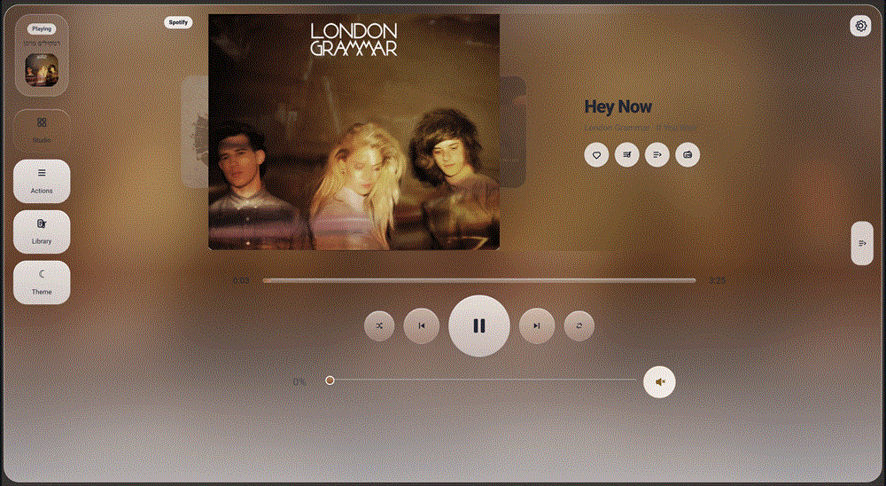

# HOMEii Music Flow Documentation

HOMEii Music Flow is a premium Music Assistant dashboard card for Home Assistant. This documentation is the main place to learn how to install it, configure it, understand every major feature, and troubleshoot real-world Music Assistant setups.

## Quick Navigation

- **Install the card:** [Getting Started](./getting-started.md)
- **Configure Music Assistant, Sendspin, `card_id`, and URL player overrides:** [Configuration](./configuration.md)
- **Learn what every screen does:** [Feature Guide](./features.md)
- **Choose the right phone/tablet/dashboard mode:** [Layouts And Mobile Modes](./layouts.md)
- **Generate a support report:** [Diagnostics](./diagnostics.md)
- **Fix common problems:** [Troubleshooting](./troubleshooting.md)

## Start Here

If you are new to HOMEii Music Flow, use this path:

1. [Getting Started](./getting-started.md)
2. [Configuration](./configuration.md)
3. [Feature Guide](./features.md)
4. [Layouts And Mobile Modes](./layouts.md)
5. [Diagnostics](./diagnostics.md)
6. [Troubleshooting](./troubleshooting.md)

## What You Need

HOMEii Music Flow needs:

- Home Assistant with dashboards/custom cards enabled.
- Music Assistant installed and connected to Home Assistant.
- HOMEii Flow Engine `0.7.2` or newer installed and loaded for HOMEii Music Flow 6.0.0 and newer.
- At least one Music Assistant player exposed as a Home Assistant `media_player`.
- HACS, or manual access to `/config/www/community/`.
- A modern browser: Chrome, Edge, Safari, iOS WebKit, Android WebView, or a current Home Assistant Companion app.

Optional features need optional setup:

- **This device / Sendspin browser player:** disabled in 6.0.0 Engine-only mode so MA credentials remain server-side.
- **Announcements:** a working Home Assistant TTS entity.
- **Automation helper:** an `input_text` helper for the active HOMEii player.
- **Remote artwork:** served through the authenticated HOMEii Flow Engine artwork proxy; the browser does not need a Music Assistant URL.

## Documentation Map

| Page | Use it for |
| --- | --- |
| [Getting Started](./getting-started.md) | HACS install, manual install, first card, first checks |
| [Configuration](./configuration.md) | YAML options, visual editor, Music Assistant connection, Sendspin, `card_id`, query-string player overrides |
| [Feature Guide](./features.md) | Main player, library, queue, Library Wheel, Queue Wheel, FLOW, Studio, lyrics, announcements, favorites, history |
| [Layouts And Mobile Modes](./layouts.md) | Phone, tablet, desktop, compact, full, edge-to-edge, Section view, Panel view |
| [Diagnostics](./diagnostics.md) | What Diagnostics v7 checks, how to copy a useful report, what each warning usually means |
| [Troubleshooting](./troubleshooting.md) | Missing artwork, empty queue, no players, HTTPS/HTTP issues, Companion app quirks |

## Recommended Dashboard Setup

For the most polished experience:

- Use a **Panel view** or a full-width **Section view** for the primary music dashboard.
- On phones, use **Full** or **Edge to edge** mode if HOMEii Music Flow is the main screen.
- Use **Compact** only when HOMEii Music Flow shares a dashboard with other cards.
- If multiple HOMEii cards run in the same browser, give each one a unique `card_id`.
- Keep Diagnostics available in the card settings. It is the fastest way to understand user reports.

## Current Documentation Target

Current documentation target: **HOMEii Music Flow 6.0.0 in progress**

6.0.0 documentation highlights:

- Required HOMEii Flow Engine backend.
- Card as visual interface, Engine as source of truth for players, queue, library, search, artwork, playback, schedules, timers, statistics, and diagnostics.
- [Reusable dashboards with `card_id`](./configuration.md#card_id)
- [Open a dashboard directly to a player with URL parameters](./configuration.md#open-a-dashboard-directly-to-a-player)
- [Library Wheel and Queue Wheel](./features.md#library-wheel)
- [Phone edge-to-edge mode](./layouts.md#edge-to-edge)
- [Diagnostics v7](./diagnostics.md)
- Group management and group-volume shortcuts
- Radio source preference and favorites-only library filtering

Release notes:

- [Changelog](../CHANGELOG.md)
- [HOMEii Music Flow 5.9.3](../RELEASE_NOTES_5.9.3.md)

## Community And Credits

HOMEii Music Flow is an independent community project. It is not an official Home Assistant or Music Assistant project.

Thanks to the Music Assistant, Home Assistant, HACS, Sendspin, and Embla projects, and to all community testers and translators who helped shape the card.
